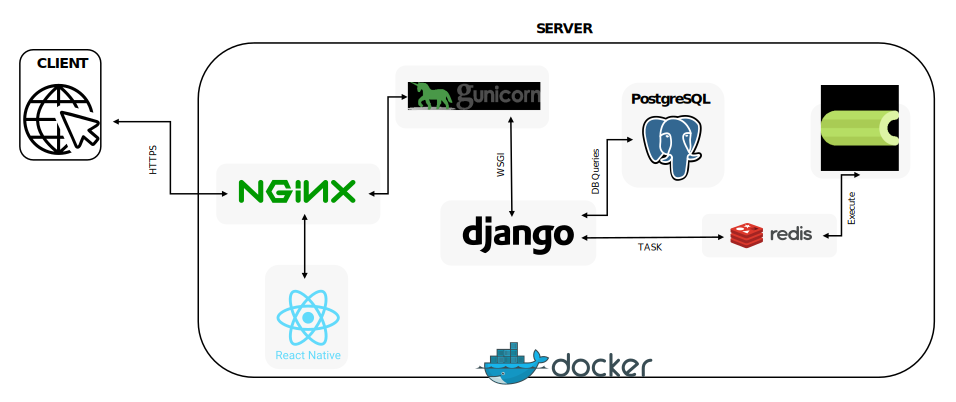

# Machine Learning-Based Web Application for Training Solar Flare Prediction Models

## Abstract
This project presents a novel cyberinfrastructure designed to advance machine learning on multivariate time series and functional networks. Addressing the challenges of data representation, our infrastructure integrates both multivariate time series and functional networks, enhancing predictive and exploratory machine learning capabilities. We introduce state-of-the-art machine learning models, including Graph Neural Networks and sequence models, to improve forecasting accuracy and data interpretability across diverse domains such as neuroscience and solar physics. Additionally, the infrastructure supports data augmentation with synthetic instances, facilitating robust model training even with limited datasets. A user-friendly, web-based interface allows researchers and the public to engage with sophisticated machine learning tools without programming expertise. Our results demonstrate significant advancements in predictive modeling and contribute to the broader accessibility of machine learning applications in life sciences.

## License

This project is licensed under the MIT License.
